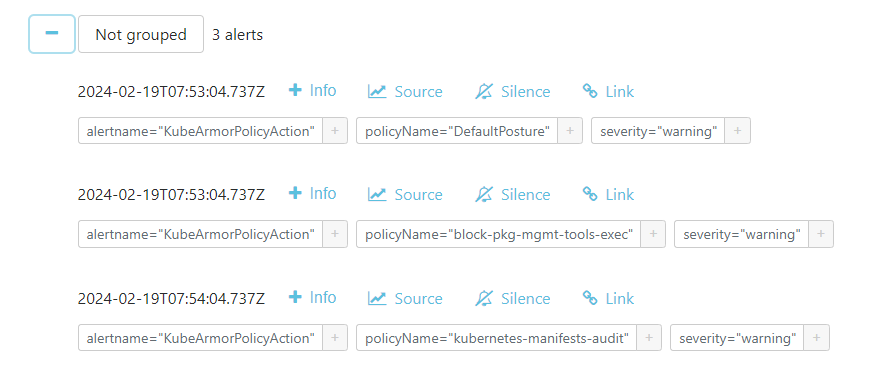

## About
This tutorial shows how to export KubeArmor telemetry data to grafana using the KubeArmor receiver and [Loki exporter](https://github.com/open-telemetry/opentelemetry-collector-contrib/tree/main/exporter/lokiexporter)

## Prerequisites
Follow the [KubeArmor deployment guide](https://github.com/kubearmor/KubeArmor/blob/main/getting-started/deployment_guide.md#L20-L19) to set up Kubearmor.

## Grafana and Loki setup
Depending on your KubeArmor setup, you can follow:
* KubeArmor in Kubernetes - [Setup Grafana and Loki in Kubernetes](#setup-grafana-and-loki-in-kubernetes)
* KubeArmor in Bare Metal - [Setup Grafana and Loki in Docker](#setup-grafana-and-loki-in-docker)

### Setup Grafana and Loki in Kubernetes
1. Install Grafana using Helm.

    Refer to the [Grafana Helm chart documentation](https://github.com/grafana/helm-charts/blob/main/charts/grafana/README.md) for advanced setup.

    A basic setup for this demo can be created by running:
    ```bash
    # add repo
    helm repo add grafana https://grafana.github.io/helm-charts

    # install Grafana
    helm install grafana grafana/grafana
    ```
    Follow the steps at the end of Helm install completion to port-forward Grafana on a local port.

2. [Install Grafana Loki](https://grafana.com/docs/loki/latest/installation/helm/install-scalable/) using Helm.

    For a basic setup in this demo with filesystem as storage and no authentication, we'll just run:
    ```bash
    helm install loki grafana/loki \
    --set loki.commonConfig.replication_factor=1 \
    --set loki.storage.type="filesystem" \
    --set loki.auth_enabled=false \
    --set singleBinary.replicas=1

    ```
    If integration with [Alertmanager](https://github.com/prometheus/alertmanager#install) is required, along with retention period, we can use `../loki-values.yaml` and run:
    ```bash
    helm upgrade --install loki grafana/loki --values ../loki-values.yaml
    ```
    Make sure to change the Alertmanager URL so that loki points to the existing Alertmanager instance.

    Visit the Grafana dasbhoard at localhost:3000 and add Loki as a datasource. The endpoint for Loki is the cluster IP service address i.e `http://loki.default.svc:3100`.

    Depending on your installation, you may want to setup advanced features like authentication and more. Follow the [Loki data source guide](https://grafana.com/docs/grafana/latest/datasources/loki/) for the same. For this demo, you won't need this.

3. Follow [Install KubeArmor OpenTelemetry receiver](./tutorial.md#collector-in-kubernetes-environment) and make any required configuration changes given below to install the custom OpenTelemetry receiver.

    **Configuration**

    The [installation manifest](../collector-k8-manifest.yml) has a configuration according to the basic loki setup.

    For advaned authentication configuration in a multi-tenant loki setup, you may do something like below:
    ```yaml
    <...>
    config:
      extensions:
        headers_setter:
          headers:
            - action: insert
              key: X-Scope-OrgID
              from_context: tenant_id
            - action: upsert
              key: User-ID
              value: user_id
      <...>
      exporters:
        <...>
        loki:
          endpoint: "http://loki.default.svc:3100/loki/api/v1/push"
          auth:
            authenticator: headers_setter
      <...>
      service:
        extensions:
          - headers_setter
        <...>
    ```

    Checkout [headerssetter extension](http://github.com/open-telemetry/opentelemetry-collector-contrib/extension/headers) for authentication.

    **Deploy the collector**
    ```bash
    kubectl apply -f example/collector-k8-manifest.yml
    ```

4. Refer to the example [Grafana dashboard](../grafana_dashboard.json) and follow [this tutorial](https://grafana.com/docs/grafana/latest/dashboards/manage-dashboards/#import-a-dashboard) to import the Grafana dashboard JSON to your instance

5. You should have a working Grafana and Loki dashboard with KubeArmor logs now. Validate if your dashboard works as expected by viewing the demo video at the bottom of this page.

6. If loki is installed with Alertmanager integration, we can apply `../kubearmor-alertrules.yaml` to see alerts being generated on Alertmanager, which can further be sent to slack, webhooks and more.

#### Cleanup
To cleanup the demo setup, run:
```bash
kubectl delete -f example/collector-k8-manifest.yml
helm uninstall loki
helm uninstall grafana
kubectl delete -f example/kubearmor-alertrules.yaml
kubectl delete -f https://github.com/open-telemetry/opentelemetry-operator/releases/latest/download/opentelemetry-operator.yaml
kubectl delete -f https://github.com/cert-manager/cert-manager/releases/latest/download/cert-manager.yaml
```

### Setup Grafana and Loki In Docker
1. Follow the [OpenTelemetry setup guide](https://grafana.com/docs/opentelemetry/collector/send-logs-to-loki/) to setup Grafana and Grafana Loki using Docker compose.

    For this demo, you can also use the [sample Docker compose](../docker-compose.yml) file using:
    ```bash
    docker compose -f example/docker-compose.yml up
    ```

2. Follow [Install KubeArmor OpenTelemetry receiver](./tutorial.md#collector-on-bare-metal) and make any required configuration changes given below to install the custom OpenTelemetry receiver.

    **Configuration**

    Refer to the example [config file](../config.yml) for configuring KubeArmor OpenTelemetry receiver.
     ```yaml
     exporters:
       <...>
       loki:
         endpoint: "<loki endpoint>"

     service:
       pipelines:
         logs:
         <...>
           exporters:
             - loki
             - logging
     ```
   To find the Loki endpoint in your Docker environment, use `docker inspect <loki-container-name>`.

   Once done with configuration, deploy the KubeArmor OpenTelemetry receiver with your custom configuration by running:
   ```bash
   docker run -d --network=host -v $PWD/example/config.yml:/otelcol-custom/config.yml --name=kubearmor-otel-adapter kubearmor/otel-adapter:latest
   ```

3. Refer to the example [Grafana dashboard](../grafana_dashboard.json) and follow [this tutorial](https://grafana.com/docs/grafana/latest/dashboards/manage-dashboards/#import-a-dashboard) to import the Grafana dashboard JSON to your instance.

    While importing, select Loki as the datasource.

4. You should have a working Grafana and Loki dashboard with KubeArmor logs now. Validate if your dashboard works as expected by viewing the demo video at the bottom of this page.

#### Cleanup
To cleanup the demo setup, run:
```bash
docker stop kubearmor-otel-adapter; docker rm kubearmor-otel-adapter
docker compose -f example/docker-compose.yml down
```

### Explore Loki and Grafana
If successful, your Loki dashboard would look similar to:


The Grafana dashboard would look similar to:


Grafana dashboard usage:
- View the amount of each unique value of each log attribute using pie chanrt, guage and table.
- Dynamically choose the log attribute that you would like to view using the `log attribute` variable
- Filter through logs using `filter` variable.

If Loki is integrated with Alertmanager, on policy actions, you'd be able to see alerts like these:


